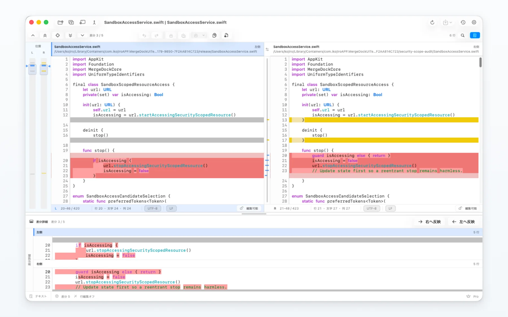
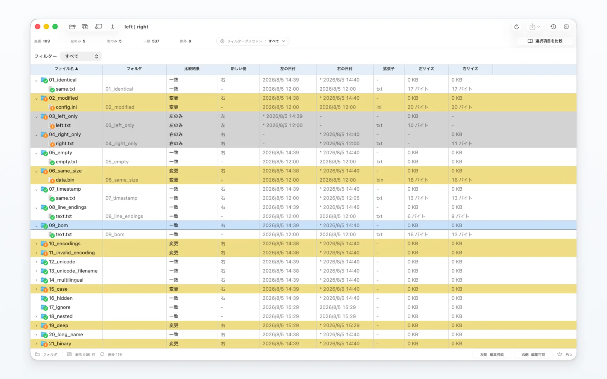
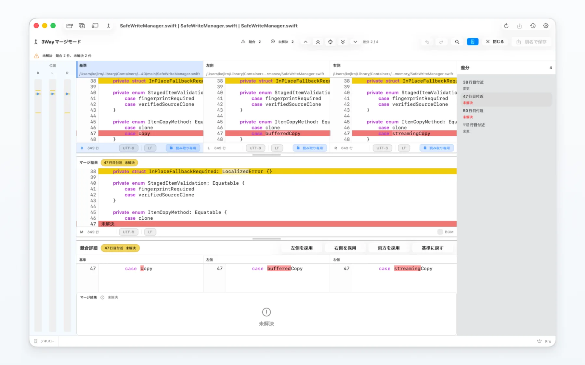
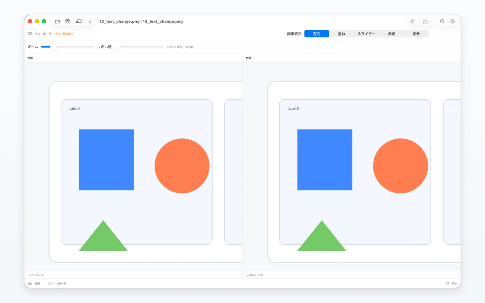

  

<h1 align="center">MergeDock</h1>

<strong>違いを明確に。マージを安全に。</strong>

  テキスト、フォルダ、画像、バイナリを比較する、macOSネイティブアプリ。 
  2Wayの差分編集、3Wayの競合解決、Git連携まで一つの画面で進められます。

  <a href="https://mergedock.net/?lang=ja">公式サイト</a> ·
  <a href="https://mergedock.net/support.html?lang=ja">サポート</a> ·
  <a href="https://mergedock.net/privacy.html?lang=ja">プライバシー</a> ·
  <a href="https://apps.apple.com/app/id6796992809">Mac App Storeで見る</a>

  <a href="README.md">English</a> ·
  <strong>日本語</strong> ·
  <a href="README.de.md">Deutsch</a> ·
  <a href="README.es.md">Español</a> ·
  <a href="README.fr.md">Français</a> ·
  <a href="README.it.md">Italiano</a> ·
  <a href="README.ko.md">한국어</a> ·
  <a href="README.pt-BR.md">Português (Brasil)</a> ·
  <a href="README.ru.md">Русский</a> ·
  <a href="README.zh-Hans.md">简体中文</a> ·
  <a href="README.zh-Hant.md">繁體中文</a>

  

## 比較に必要なものを一つの画面に

MergeDockは、原本、差分、マージ結果、検索、位置ペイン、文字コード情報、保存操作を一つのワークスペースにまとめます。確認から解決まで、現在位置を見失わずに進められます。

- **テキスト比較：** 連動する2Wayペイン、行差分・行内差分、検索、シンタックス表示、行編集、左右への反映、Unified Diff／Patch書き出しに対応します。
- **3Wayマージ：** 基準と2つの変更版を並べ、未解決領域を保護したまま解決方法を選択し、保存前にマージ結果を確認できます。
- **超大規模ファイル：** 全文を画面へ展開せず、索引を使って表示中の範囲へ効率よくアクセスします。
- **フォルダ比較：** 階層フォルダ、フィルター、メタデータ、個別ファイルの詳細比較に対応。コピーや削除の前には確認を表示します。
- **画像比較：** 左右、重ね合わせ、スライダー、点滅、差分表示を切り替え、ピクセル差や寸法差を確認できます。
- **バイナリ比較：** テキストとして扱えないファイルの変更をバイト単位で確認できます。
- **Git連携：** `git difftool`から比較を開き、`git mergetool`から競合解決を開始できます。

## テキスト比較

変更ブロックを確認しながら差分間を移動し、編集可能な側を直接修正できます。文字コードと改行コードも常に確認できます。

  

## フォルダ比較

一致、変更、片側のみ、種類不一致を一覧化します。気になる項目は詳しい比較で開き、内容を確認してからコピーできます。

  

## 3Wayマージ

基準と左右の変更版を連動表示しながら競合を解決します。未解決領域は、解決方法を選ぶまで編集から保護されます。

  

## 画像比較

ファイルを開き直さずに表示方法を切り替え、確認したい部分を拡大できます。

  

## Macの中で完結

- ファイル比較とマージ処理はMac上で実行します。
- ファイル内容を外部の比較サービスへアップロードしません。
- 選択したファイルやフォルダへのアクセスにはmacOS標準の権限画面を使用します。
- 広告SDKやアプリをまたぐ追跡は含みません。
- 復旧データと比較履歴は利用者が管理できます。

詳しくは[プライバシーポリシー](https://mergedock.net/privacy.html?lang=ja)をご確認ください。

## 対応環境とダウンロード

- macOS 26以降
- Appleシリコン／Intel Mac対応のUniversal 2アプリ
- Mac App Storeから配布
- 無料で開始でき、Pro機能はアプリ内課金で利用可能

**[Mac App StoreからMergeDockをダウンロード](https://apps.apple.com/app/id6796992809)**

## サポート

まず[MergeDockサポートページ](https://mergedock.net/support.html?lang=ja)をご確認ください。[GitHubでサポートIssueを作成](../../issues/new/choose)するか、[support@mergedock.net](mailto:support@mergedock.net)へ連絡することもできます。

不具合を報告する場合は、次の情報をお知らせください。

1. MergeDockとmacOSのバージョン。
2. 使用していた比較モード。
3. 行った操作と期待していた結果。
4. 実際に起きたこと。表示された場合は正確なエラーメッセージ。
5. 必要な場合のみ、機密情報を取り除いたスクリーンショットやサンプルデータ。

> **機密ファイル、認証情報、個人情報、未加工のログは添付しないでください。**

## 公式リンク

- [公式サイト](https://mergedock.net/?lang=ja)
- [サポート・利用規約](https://mergedock.net/support.html?lang=ja)
- [プライバシーポリシー](https://mergedock.net/privacy.html?lang=ja)
- [Mac App Store](https://apps.apple.com/app/id6796992809)

## このリポジトリについて

この公開リポジトリは、MergeDockの製品情報とサポート情報を掲載するためのものです。MergeDockアプリのソースコードは配布していません。MergeDockおよび掲載画像は独自の著作物であり、許可なく再配布することはできません。

Copyright © 2026 MergeDock. All rights reserved.
