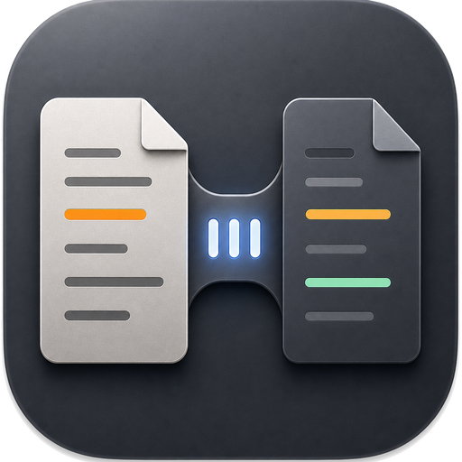
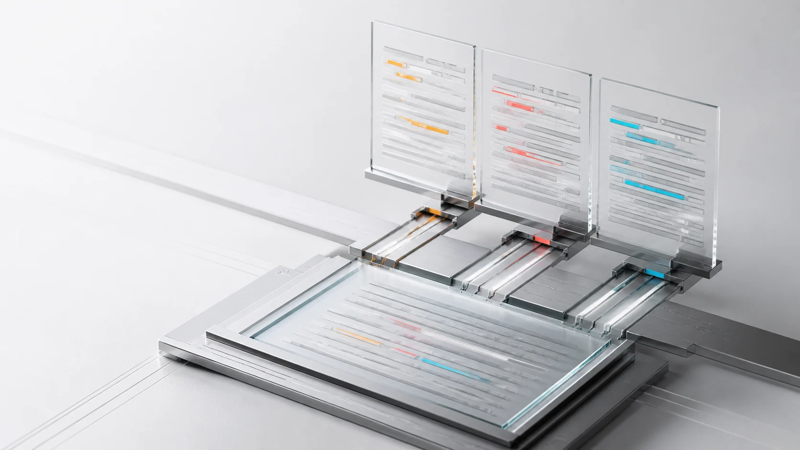
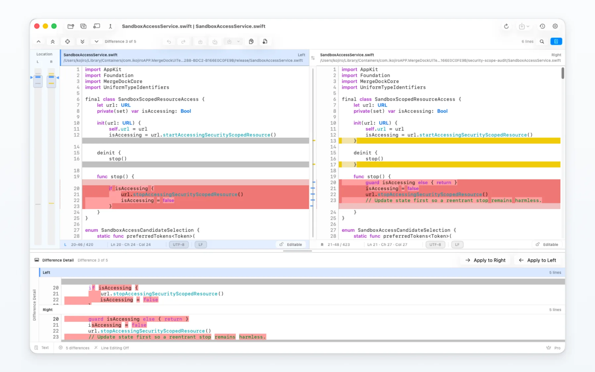
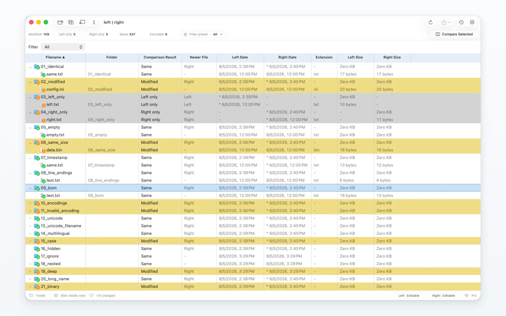
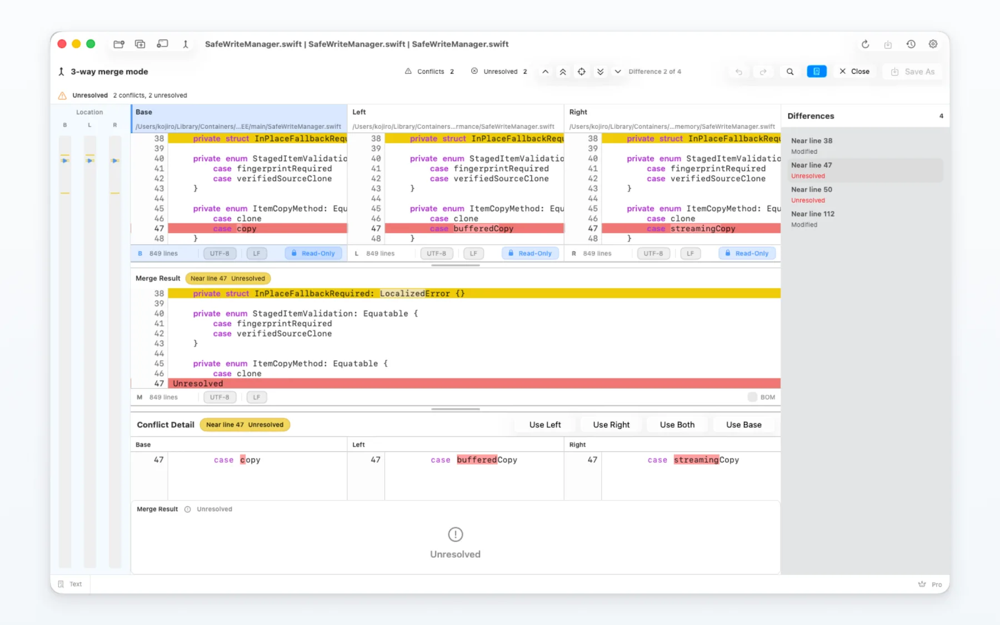
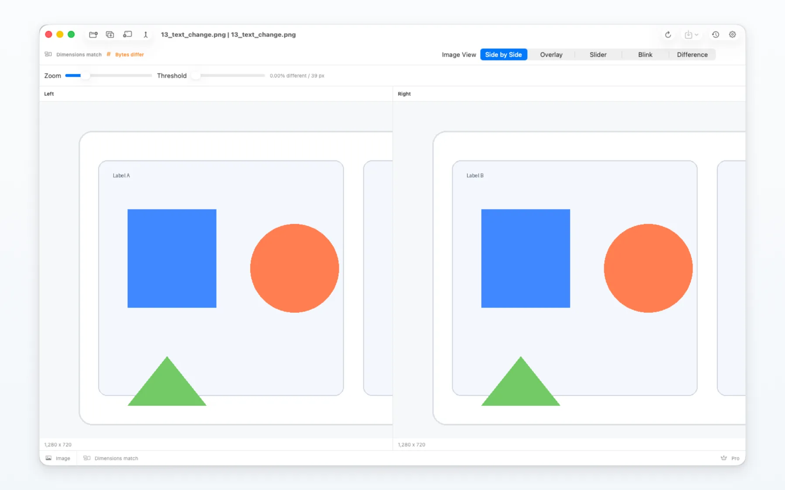

  

<h1 align="center">MergeDock</h1>

<strong>Compare clearly. Merge safely.</strong>

  A focused, native macOS app for comparing text, folders, images, and binary files. 
  Edit 2-Way differences, resolve 3-Way conflicts, and keep Git workflows moving.

  <a href="https://mergedock.net">Website</a> ·
  <a href="https://mergedock.net/support.html">Support</a> ·
  <a href="https://mergedock.net/privacy.html">Privacy</a> ·
  <a href="https://apps.apple.com/app/id6796992809">View on the Mac App Store</a>

  <strong>English</strong> ·
  <a href="README.ja.md">日本語</a> ·
  <a href="README.de.md">Deutsch</a> ·
  <a href="README.es.md">Español</a> ·
  <a href="README.fr.md">Français</a> ·
  <a href="README.it.md">Italiano</a> ·
  <a href="README.ko.md">한국어</a> ·
  <a href="README.pt-BR.md">Português (Brasil)</a> ·
  <a href="README.ru.md">Русский</a> ·
  <a href="README.zh-Hans.md">简体中文</a> ·
  <a href="README.zh-Hant.md">繁體中文</a>

  

## One workspace for every comparison

MergeDock keeps the source, differences, merge result, search, location overview, encoding information, and save actions together. You can move from inspection to resolution without losing your place.

- **Text comparison:** synchronized 2-Way panes, line and inline differences, search, syntax coloring, editing, copy actions, and Unified Diff or Patch export.
- **3-Way merge:** compare the base and both revisions, protect unresolved regions, choose a resolution, and review the merged result before saving.
- **Very large files:** indexed access keeps the visible area responsive without placing the entire document in the interface at once.
- **Folder comparison:** inspect nested folders, filter results, review metadata, and confirm copy or delete operations before anything changes on disk.
- **Image comparison:** use side-by-side, overlay, slider, blink, and difference views to inspect pixel and dimension changes.
- **Binary comparison:** inspect byte-level changes when a text interpretation is not appropriate.
- **Git workflows:** open comparisons from `git difftool` and conflict resolution from `git mergetool`.

## Text comparison

Review changed blocks, move between differences, edit either side when allowed, and keep line endings and encodings visible.

  

## Folder comparison

See what is identical, changed, present on one side, or different in type. Open an item for a closer comparison or copy it after reviewing the confirmation.

  

## 3-Way merge

Keep the base and both revisions aligned while resolving conflicts. Unresolved regions remain protected until you choose a resolution.

  

## Image comparison

Switch views without reopening the files and zoom in on the part that matters.

  

## Local by design

- File comparison and merge processing run on your Mac.
- File content is not uploaded to an external comparison service.
- MergeDock uses macOS permission panels for the files and folders you choose.
- The app does not include advertising SDKs or cross-app tracking.
- Recovery data and comparison history stay under your control.

Read the full [Privacy Policy](https://mergedock.net/privacy.html).

## Requirements and availability

- macOS 26 or later
- Native Universal 2 app for Apple silicon and Intel Macs
- Distributed through the Mac App Store
- Free to start; Pro features are available as an in-app purchase

**[View MergeDock on the Mac App Store](https://apps.apple.com/app/id6796992809)**

## Support

Start with the [MergeDock Support page](https://mergedock.net/support.html). You can also [open a GitHub support issue](../../issues/new/choose) or email [support@mergedock.net](mailto:support@mergedock.net).

When reporting a problem, please include:

1. Your MergeDock and macOS versions.
2. The comparison mode you were using.
3. The action you performed and what you expected to happen.
4. What happened instead, including the exact error message when available.
5. Sanitized screenshots or sample data only when they are necessary.

> **Do not attach confidential source files, credentials, personal information, or unredacted logs.**

## Links

- [Official website](https://mergedock.net)
- [Support and Terms of Use](https://mergedock.net/support.html)
- [Privacy Policy](https://mergedock.net/privacy.html)
- [Mac App Store](https://apps.apple.com/app/id6796992809)

## About this repository

This public repository contains product information and support resources for MergeDock. It does not distribute the MergeDock application source code. MergeDock and its visual assets are proprietary and may not be redistributed without permission.

Copyright © 2026 MergeDock. All rights reserved.
